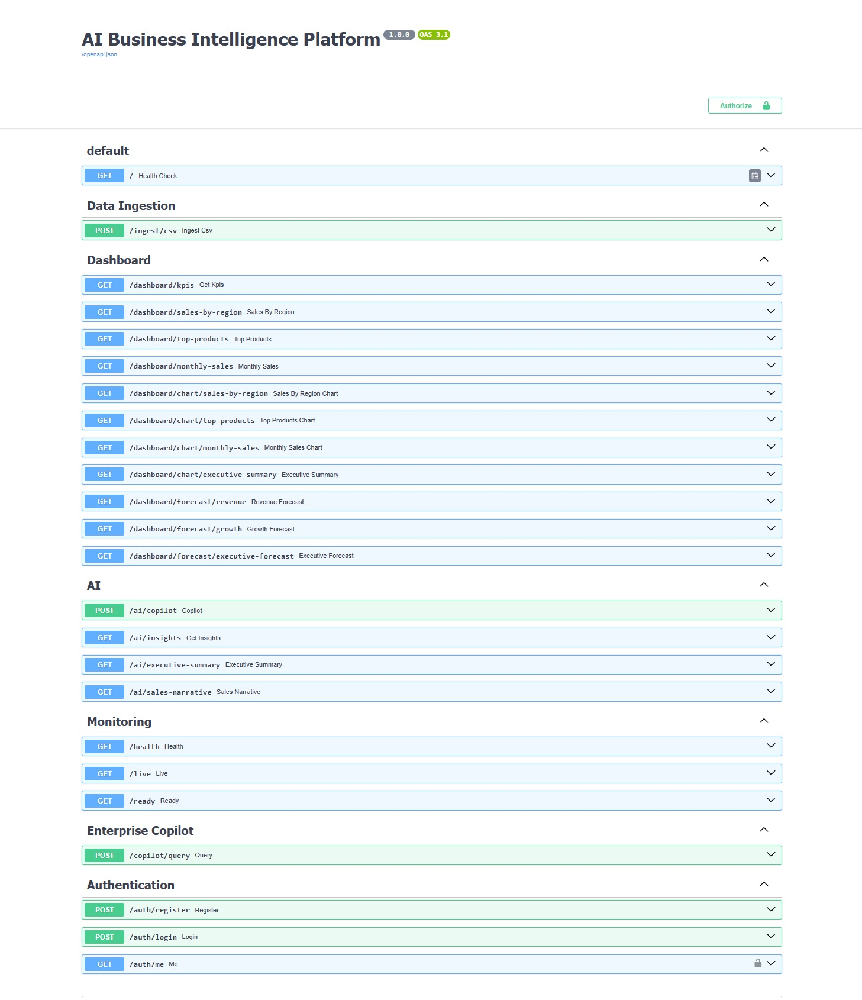
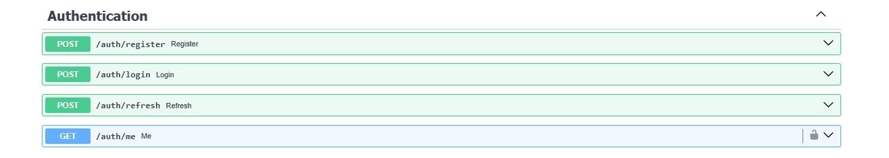
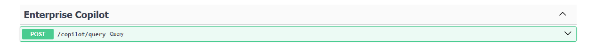
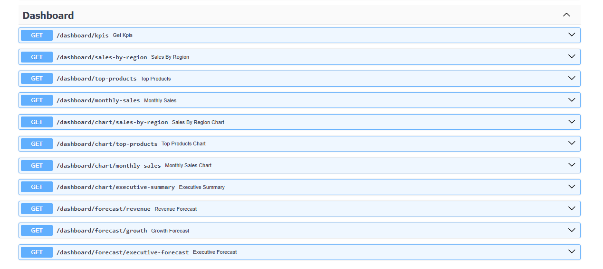
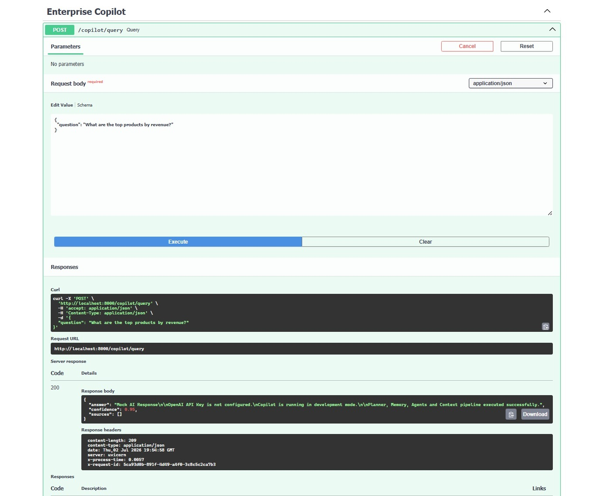
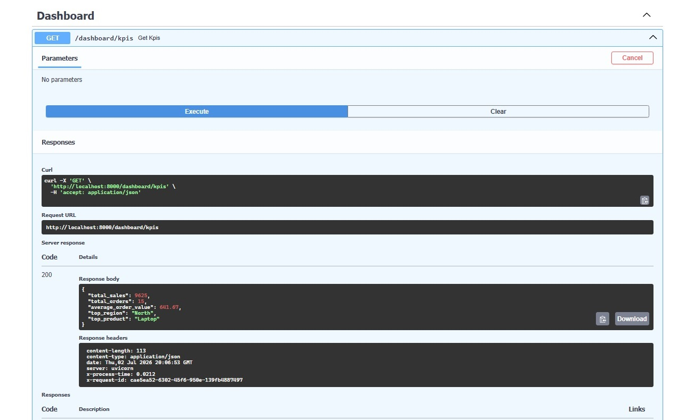

# Enterprise AI Business Intelligence Platform

> A production-grade AI-powered Business Intelligence platform combining JWT-secured REST APIs, a Multi-Agent AI Copilot, Star Schema data warehousing, ETL ingestion, and enterprise-ready infrastructure — **v1.0.0 Foundation Release**.

[](https://github.com/Mehdiest/Enterprise-AI-Business-Intelligence-Platform)
[](https://www.python.org/)
[](https://fastapi.tiangolo.com/)
[](LICENSE)
[](YOUR_LOOM_LINK_HERE)

---

## Overview

The **Enterprise AI Business Intelligence Platform** is a production-oriented backend system designed for organizations that need intelligent, natural-language access to their data. It is not a simple dashboard — it is a modular, layered backend that provides:

- Secure JWT authentication with role-based access
- A fully orchestrated Multi-Agent AI Copilot pipeline
- Star schema data warehouse with CSV ingestion via ETL
- Dashboard and forecasting APIs backed by real analytics services
- A pluggable LLM provider layer ready for OpenAI, Azure, Anthropic, and local models
- Enterprise infrastructure: structured logging, request tracking, health monitoring, feature flags

Version 1 delivers all of this as a complete, runnable backend. Future versions will extend it toward autonomous decision intelligence.

---

## Architecture

```
                           ┌──────────────────────┐
                           │      Swagger UI       │
                           └──────────┬────────────┘
                                      │
                                      ▼
                         ┌────────────────────────┐
                         │       FastAPI          │
                         │  Middleware Pipeline   │
                         │  RequestID │ Timing    │
                         │  Logging   │ Exception │
                         └──────────┬─────────────┘
                                    │
       ┌──────────────┬─────────────┼──────────────┬─────────────┐
       ▼              ▼             ▼              ▼             ▼
   Auth API     Copilot API   Dashboard API   Ingest API   Health API
       │              │
       ▼              ▼
  Auth Service   CopilotEngine
       │              │
       ▼         ┌────┴──────────────────────┐
  PostgreSQL     │   Multi-Agent Pipeline    │
  (User Table)   │                           │
                 │  Intent Classifier        │
                 │  Context Builder          │
                 │  Planner Agent            │
                 │  Execution Engine         │
                 │  ├── Retriever Agent      │
                 │  ├── SQL Agent            │
                 │  ├── Analytics Agent      │
                 │  └── Response Agent       │
                 │  Prompt Builder           │
                 │  LLM Provider Layer       │
                 └────────────┬──────────────┘
                              │
                    ┌─────────┴──────────┐
                    │   Data Platform    │
                    │  ETL Pipeline      │
                    │  Star Schema       │
                    │  PostgreSQL        │
                    └────────────────────┘
```

---

## Multi-Agent Pipeline

```
User Question
      │
      ▼
Intent Classifier  (rule-based: sales / product / region / KPI / trend / summary)
      │
      ▼
Context Builder    (semantic retrieval, session context)
      │
      ▼
Planner Agent      (builds execution plan)
      │
      ▼
Execution Engine   (runs agents from registry)
      │
      ├── Retriever Agent   (FAISS vector retrieval)
      ├── SQL Agent         (generates, validates, executes SQL)
      ├── Analytics Agent   (KPI / stats aggregation)
      └── Response Agent    (formats final output)
      │
      ▼
Prompt Builder     (enterprise prompt engineering)
      │
      ▼
LLM Provider       (OpenAI / Mock — factory pattern)
      │
      ▼
Enterprise Response  (answer + confidence + cited sources)
```

---

## Features

### Authentication
- User registration with email validation and bcrypt password hashing
- JWT login via OAuth2 Password Flow
- Protected endpoints with dependency injection (`get_current_user`)
- Role-aware user model; Swagger Authorization built-in

### Enterprise AI Copilot
- **Intent Classification** — rule-based classifier covering sales, product, region, KPI, trend, and summary intents with confidence scoring
- **Context Builder** — builds retrieval context per question and session
- **Planner Agent** — generates structured execution plans
- **Execution Engine** — dispatches agents from an extensible registry
- **Agent Registry** — Retriever, SQL, Analytics, Response agents
- **Prompt Builder** — enterprise prompt templates
- **Conversation Memory** — in-memory session history with windowed context
- **Response Pipeline** — citation engine, confidence scoring, hallucination guard, response validator
- **LLM Provider Layer** — factory pattern; OpenAI provider implemented; mock provider for development; ready for Azure, Anthropic, Ollama

### Dashboard & Analytics
- KPI engine (total revenue, order count, averages)
- Sales by region, top products, monthly sales
- Chart-ready dataset responses for frontend integration
- Executive summary endpoint
- Revenue forecast, growth forecast, executive forecast

### Data Platform
- CSV upload endpoint with file validation
- ETL pipeline: CSVLoader → DataTransformer → WarehouseLoader
- PostgreSQL star schema warehouse with Alembic migrations
- Dimension tables: `dim_customer`, `dim_product`, `dim_region`, `dim_channel`, `dim_date`
- Fact table: `fact_sales` (quantity, amount, UUID foreign keys, audit timestamps, indexed)

### Enterprise Infrastructure
- Four middleware layers: RequestID, Timing, Logging, Exception
- Health checker with live database probe and metrics collection
- Feature flags: SQL Agent, RAG, Analytics, Streaming, Cache, Debug
- Environment separation: development / testing / staging / production
- Structured logging via Loguru
- Makefile for common dev operations (run, build, test, lint, format)

---

## Tech Stack

| Layer | Technologies |
|---|---|
| **Backend** | Python 3.12, FastAPI, SQLAlchemy, Pydantic v2, Pydantic Settings, Alembic, Uvicorn |
| **Auth** | JWT (python-jose), bcrypt, OAuth2 Password Flow |
| **AI / ML** | Multi-Agent Architecture, FAISS, Sentence Transformers, RAG, LangChain |
| **LLM** | OpenAI SDK (gpt-4.1-mini), Mock Provider, Factory Pattern |
| **Data** | PostgreSQL, Star Schema, Pandas, NumPy, Scikit-Learn, OpenPyXL |
| **Infrastructure** | Docker, Docker Compose, Loguru, psutil, Feature Flags |
| **Dev Tools** | Git, GitHub, Pytest, Black, Ruff, VS Code, Makefile |

---

## Project Structure

```
Enterprise-AI-Business-Intelligence-Platform/
├── app/
│   ├── main.py
│   ├── config.py
│   ├── database.py
│   ├── security.py
│   ├── core/
│   │   ├── settings.py
│   │   ├── environment.py
│   │   ├── feature_flags.py
│   │   ├── logging.py
│   │   └── constants.py
│   ├── middleware/
│   │   ├── request_id.py
│   │   ├── timing.py
│   │   ├── logging.py
│   │   └── exception.py
│   ├── routers/
│   │   ├── auth.py
│   │   ├── copilot.py
│   │   ├── dashboard.py
│   │   ├── ingest.py
│   │   ├── ai.py
│   │   └── health.py
│   ├── services/
│   │   ├── auth.py
│   │   ├── analytics/
│   │   │   ├── kpi.py
│   │   │   ├── stats.py
│   │   │   ├── charts.py
│   │   │   └── forecast.py
│   │   ├── etl/
│   │   │   ├── csv_loader.py
│   │   │   ├── transformer.py
│   │   │   └── warehouse_loader.py
│   │   └── ai/
│   │       ├── embeddings.py
│   │       ├── insights.py
│   │       ├── retrieval/
│   │       │   ├── base.py
│   │       │   ├── faiss.py
│   │       │   └── manager.py
│   │       ├── vector_store/
│   │       │   ├── faiss_store.py
│   │       │   ├── knowledge_base.py
│   │       │   ├── index_builder.py
│   │       │   └── persistence/
│   │       ├── knowledge/
│   │       │   ├── engine.py
│   │       │   ├── kpi.py
│   │       │   ├── product.py
│   │       │   └── region.py
│   │       ├── llm/
│   │       │   ├── base.py
│   │       │   └── factory.py
│   │       ├── providers/
│   │       │   ├── base.py
│   │       │   ├── factory.py
│   │       │   ├── mock_provider.py
│   │       │   └── openai_provider.py
│   │       └── copilot/
│   │           ├── engine.py
│   │           ├── service.py
│   │           ├── intent/
│   │           ├── context/
│   │           ├── context_runtime/
│   │           ├── planner/
│   │           ├── executor/
│   │           ├── prompt/
│   │           ├── memory/
│   │           ├── response/
│   │           ├── tools/
│   │           └── agents/
│   │               ├── planner/
│   │               ├── sql/
│   │               ├── retriever/
│   │               ├── analytics/
│   │               └── response/
│   ├── models/
│   │   ├── user.py
│   │   └── warehouse.py
│   ├── schemas/
│   ├── monitoring/
│   │   ├── health.py
│   │   └── metrics.py
│   └── dependencies/
│       └── auth.py
├── alembic/
│   └── versions/
│       └── 001_initial_star_schema.py
├── tests/
│   └── manual/
├── requirements/
│   ├── base.txt
│   ├── ai.txt
│   ├── dev.txt
│   └── all.txt
├── docker-compose.yml
├── dockerfile
└── Makefile
```

---

## Screenshots

**Swagger UI Overview**


**Authentication Endpoints**


**Enterprise Copilot Endpoints**


**Dashboard Endpoints**


**Live AI Copilot Query**


**CSV Ingestion**


**Live Dashboard KPIs**


---

## Getting Started

### Prerequisites

- Python 3.12+
- Docker & Docker Compose
- PostgreSQL 15+ (or use Docker Compose — recommended)

### Installation

```bash
# Clone the repository
git clone https://github.com/Mehdiest/Enterprise-AI-Business-Intelligence-Platform.git
cd Enterprise-AI-Business-Intelligence-Platform
```

### Environment Variables

Create a `.env.docker` file in the project root:

```env
PROJECT_NAME=AI Business Intelligence Platform
API_V1_PREFIX=/api/v1

POSTGRES_HOST=postgres
POSTGRES_PORT=5432
POSTGRES_DB=ai_bi
POSTGRES_USER=postgres
POSTGRES_PASSWORD=postgres

SECRET_KEY=change-this-secret-key
ALGORITHM=HS256
ACCESS_TOKEN_EXPIRE_MINUTES=30

OPENAI_API_KEY=
```

> Leave `OPENAI_API_KEY` empty to use the built-in development mock provider.

### Docker Setup (Recommended)

```bash
# Build and start all services
docker compose build
docker compose up

# Or using Makefile
make docker-build
make docker-up

# View logs
make docker-logs

# Stop
make docker-down
```

### Local Setup

```bash
pip install -r requirements/base.txt
uvicorn app.main:app --reload

# Or
make install
make run
```

### API Documentation

| Interface | URL |
|---|---|
| Swagger UI | `http://localhost:8000/docs` |
| ReDoc | `http://localhost:8000/redoc` |
| Health Check | `http://localhost:8000/health` |

---

## Authentication Workflow

The platform uses **OAuth2 Password Flow** with JWT tokens.

**Register**
```bash
POST /auth/register
Content-Type: application/json

{ "full_name": "John Doe", "email": "john@example.com", "password": "secret" }
```

**Login**
```bash
POST /auth/login
```
```json
{ "access_token": "eyJ...", "token_type": "bearer" }
```

**Swagger Authorization** — click **Authorize**, enter your credentials. Swagger automatically stores the JWT for all subsequent requests.

---

## API Endpoints

### Authentication

| Method | Endpoint | Description |
|---|---|---|
| POST | `/auth/register` | Register a new user |
| POST | `/auth/login` | Login and receive JWT |
| GET | `/auth/me` | Get current authenticated user |

### AI Copilot

| Method | Endpoint | Description |
|---|---|---|
| POST | `/copilot/query` | Submit a natural language question |

**Example Request:**
```bash
curl -X POST http://localhost:8000/copilot/query \
  -H "Content-Type: application/json" \
  -d '{"question": "What are the top products by revenue?"}'
```

**Example Response:**
```json
{
  "answer": "Based on the warehouse data, the top products by revenue are...",
  "confidence": 0.95,
  "sources": [
    { "id": "1", "text": "fact_sales joined with dim_product", "score": 1.0 }
  ]
}
```

### Dashboard & Analytics

| Method | Endpoint | Description |
|---|---|---|
| GET | `/dashboard/kpis` | Enterprise KPI metrics |
| GET | `/dashboard/sales-by-region` | Regional sales breakdown |
| GET | `/dashboard/top-products` | Top products by revenue |
| GET | `/dashboard/monthly-sales` | Monthly sales trends |
| GET | `/dashboard/chart/sales-by-region` | Chart-ready regional data |
| GET | `/dashboard/chart/top-products` | Chart-ready product data |
| GET | `/dashboard/chart/monthly-sales` | Chart-ready monthly data |
| GET | `/dashboard/chart/executive-summary` | Executive summary |
| GET | `/dashboard/forecast/revenue` | Revenue forecast |
| GET | `/dashboard/forecast/growth` | Growth forecast |
| GET | `/dashboard/forecast/executive-forecast` | Executive forecast |

### Data Ingestion

| Method | Endpoint | Description |
|---|---|---|
| POST | `/ingest/csv` | Upload CSV and load into warehouse |

### Health

| Method | Endpoint | Description |
|---|---|---|
| GET | `/health` | Health check with DB probe and metrics |
| GET | `/` | Root liveness check |

---

## Security

- JWT tokens with configurable expiry (`ACCESS_TOKEN_EXPIRE_MINUTES`)
- Passwords hashed with bcrypt (`passlib`)
- OAuth2 Password Flow with Swagger integration
- Protected endpoints via FastAPI dependency injection
- No secrets in source code — environment variable management only
- SQLAlchemy ORM prevents SQL injection on application queries
- Global exception middleware prevents stack trace leakage

---

## Roadmap

| Version | Status | Focus |
|---|---|---|
| **v1.0.0** | ✅ Released | JWT Auth, Multi-Agent Copilot, Star Schema, ETL, Dashboard APIs, Forecasting, Docker |
| **v1.1.0** | 🔜 Planned | Live SQL Tool Calling, Real RAG Knowledge Base, Persistent Conversation Memory |
| **v1.2.0** | 🔜 Planned | Streaming Responses, Multi-Provider Routing, Agent Orchestration |
| **v2.0** | 🔭 Vision | Autonomous Decision Intelligence |

---

## Contributing

Contributions, issues, and feature requests are welcome. Please open an issue first to discuss what you would like to change.

1. Fork the repository
2. Create your feature branch (`git checkout -b feature/your-feature`)
3. Commit your changes (`git commit -m 'feat: add your feature'`)
4. Push to the branch (`git push origin feature/your-feature`)
5. Open a Pull Request

---

## License

This project is licensed under the MIT License. See [LICENSE](LICENSE) for details.

---

> Built with production standards — clean architecture, layered services, and a modular AI pipeline designed to scale from a single deployment to a full enterprise decision intelligence system.
