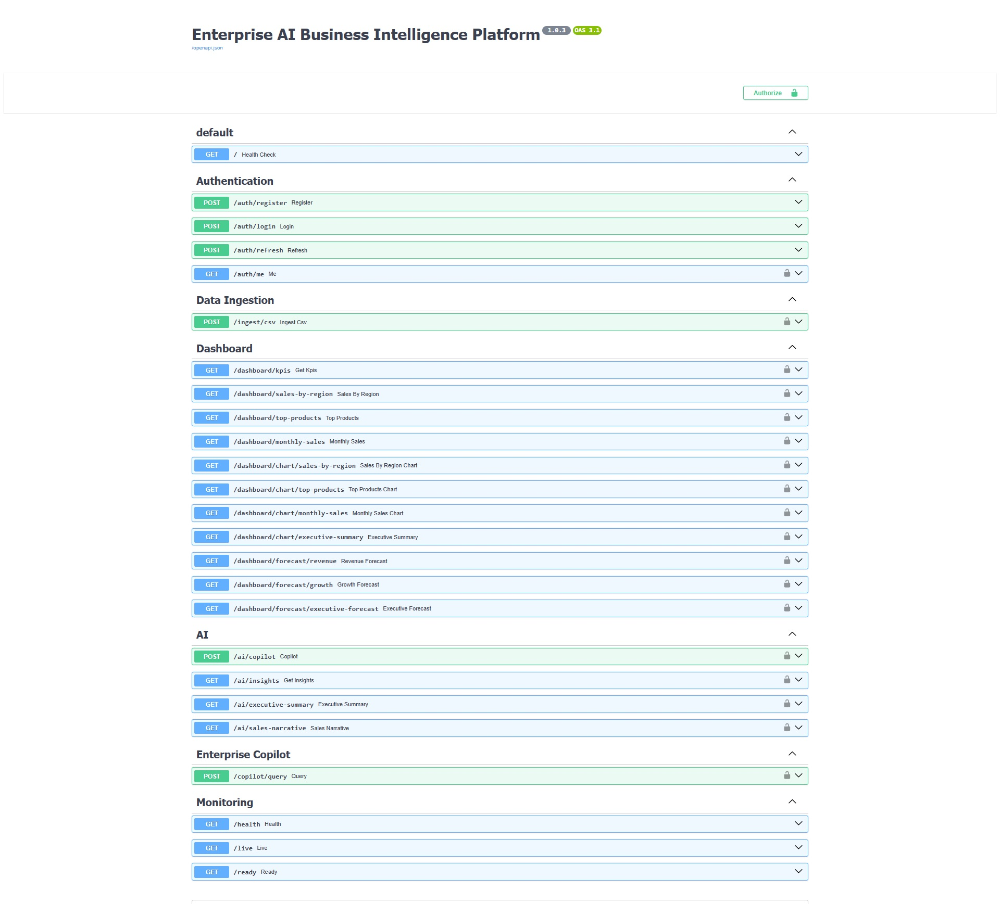
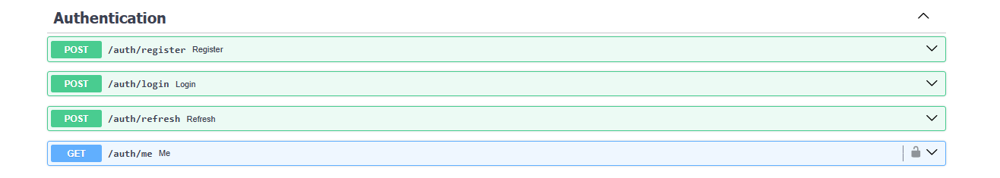
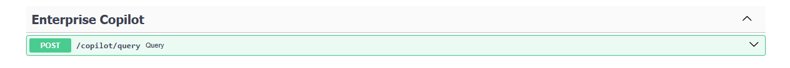
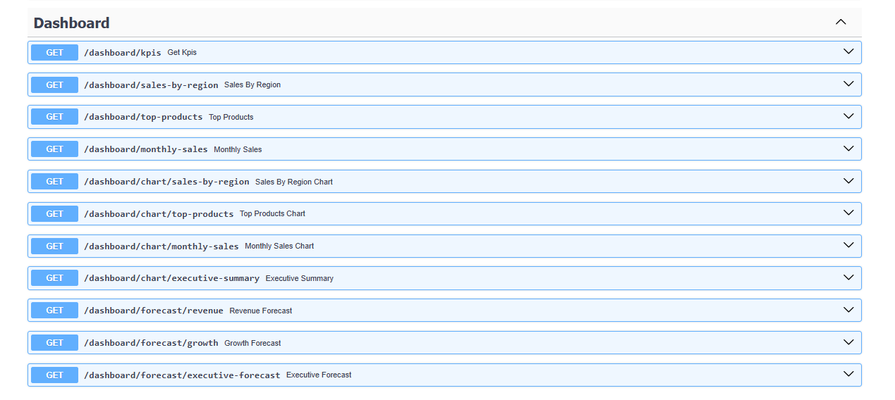
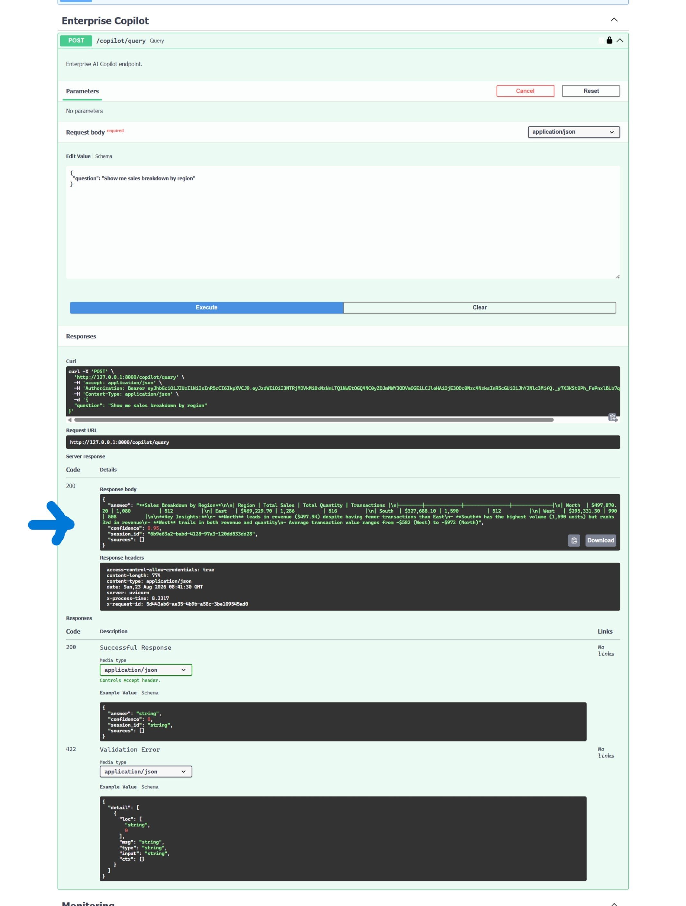
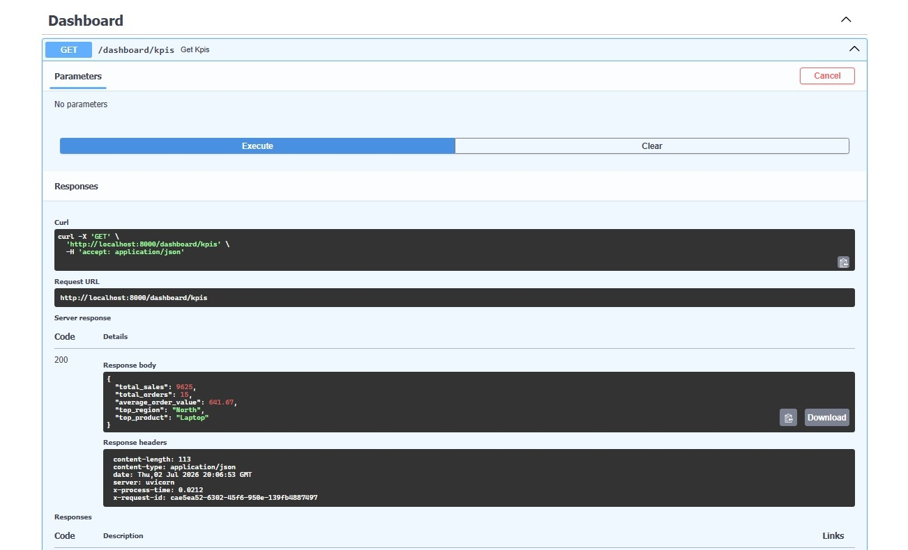

# Enterprise AI Business Intelligence Platform

> A production-grade AI-powered Business Intelligence platform combining JWT-secured REST APIs, enterprise Role-Based Access Control (RBAC), a Multi-Agent AI Copilot, Star Schema data warehousing, ETL ingestion, and production-ready infrastructure — **v1.1.0 Live SQL Tool Calling, Real RAG Knowledge Base & Persistent Conversation Memory Release**.

[](https://github.com/Mehdiest/Enterprise-AI-Business-Intelligence-Platform)
[](https://www.python.org/)
[](https://fastapi.tiangolo.com/)
[](docker-compose.yml)
[](https://www.postgresql.org/)
[](LICENSE)
[](https://ai-bi-platform-ki1b.onrender.com/docs)

---

## Live Demo

The full backend is deployed and publicly testable — no cloning or local setup required.

**Swagger UI:** [ai-bi-platform-ki1b.onrender.com/docs](https://ai-bi-platform-ki1b.onrender.com/docs)

Try it directly:
- `POST /copilot/query` — ask a natural language business question
- `GET /dashboard/kpis` — live KPIs computed from real warehouse data
- `GET /health` — service health check

> **Note:** The platform is hosted on Render's free tier. If the first request takes 30–60 seconds to respond, the server is waking up from sleep — subsequent requests will be instant.

---

## Quick Start — No Setup Required

The platform is live and publicly testable in under a minute:

**1. Open Swagger UI**
[ai-bi-platform-ki1b.onrender.com/docs](https://ai-bi-platform-ki1b.onrender.com/docs)

> If the page takes 30–60 seconds to load, the server is waking up — wait and refresh.

**2. Log in with a test account**

The platform provides **two test accounts** with different access levels:

### Option A: Demo Account (Viewer Role - Basic Access)
> Use this for basic Copilot queries and dashboard viewing

- Open `POST /auth/login` → **Try it out**
- Enter the following credentials:
```
username: demo@enterprise-bi.com
password: Demo@12345
```

### Option B: Admin Account (Full Access) ⭐
> **Recommended for complete feature testing** — unlocks ALL endpoints including AI admin features

- Open `POST /auth/login` → **Try it out**
- Enter the following credentials:
```
username: admin@enterprise-bi.com
password: Admin@12345
```

| Feature | Demo (Viewer) | Admin |
|---------|---------------|-------|
| `/copilot/query` | ✅ | ✅ |
| `/dashboard/*` | ✅ | ✅ |
| `/ai/copilot` | ❌ 403 Forbidden | ✅ Full Access |
| `/ai/insights` | ❌ 403 Forbidden | ✅ Full Access |
| `/ingest/csv` | ❌ 403 Forbidden | ✅ Full Access |

- Click **Execute** and copy the `access_token` from the response body

**3. Authorize Swagger with the token**

- Click the green **Authorize** button (top right of the Swagger page)
- Paste your chosen credentials (`username` / `password`) into the OAuth2 form
- Click **Authorize** → then **Close**

You are now authenticated. All endpoints matching your role are unlocked.

> 💡 **Tip:** Use the **Admin account** to test the complete platform including:
> - `POST /ai/copilot` — Advanced AI Copilot (admin-only endpoint)
> - `GET /ai/insights` — AI-generated business insights
> - `POST /ingest/csv` — Upload your own data files
> 
> These return `403 Forbidden` with the demo viewer account.

**4. Try the AI Copilot**

`POST /copilot/query` → **Try it out** → **Execute**:
```json
{
  "question": "What are the top products by revenue?"
}
```

**5. Check live KPIs**

`GET /dashboard/kpis` → **Try it out** → **Execute** — returns real warehouse metrics instantly.

---

## Overview

The **Enterprise AI Business Intelligence Platform** is a production-oriented backend system designed for organizations that need intelligent, natural-language access to their data. It is not a simple dashboard — it is a modular, layered backend that provides:

- Secure JWT authentication with Access & Refresh Tokens
- Enterprise Role-Based Access Control (RBAC)
- Production-grade authorization dependency layer
- A fully orchestrated Multi-Agent AI Copilot pipeline
- Star schema data warehouse with CSV ingestion via ETL
- Dashboard and forecasting APIs backed by real analytics services
- A pluggable LLM provider layer ready for OpenAI, Azure, Anthropic, and local models
- Enterprise infrastructure: structured logging, request tracking, health monitoring, feature flags

Version 1 delivers all of this as a complete, runnable backend. Future versions will extend it toward autonomous decision intelligence.

---

## Architecture

```
                           ┌──────────────────────┐
                           │      Swagger UI       │
                           └──────────┬────────────┘
                                      │
                                      ▼
                         ┌────────────────────────┐
                         │       FastAPI          │
                         │  Middleware Pipeline   │
                         │  RequestID │ Timing    │
                         │  Logging   │ Exception │
                         └──────────┬─────────────┘
                                    │
       ┌──────────────┬─────────────┼──────────────┬─────────────┐
       ▼              ▼             ▼              ▼             ▼
   Auth API     Copilot API   Dashboard API   Ingest API   Health API
       │              │
       ▼              ▼
  Auth Service   CopilotEngine
       │              │
       ▼         ┌────┴──────────────────────┐
  PostgreSQL     │   Multi-Agent Pipeline    │
  (User Table)   │                           │
                 │  Intent Classifier        │
                 │  Context Builder          │
                 │  Planner Agent            │
                 │  Execution Engine         │
                 │  ├── Retriever Agent      │
                 │  ├── SQL Agent            │
                 │  ├── Analytics Agent      │
                 │  └── Response Agent       │
                 │  Prompt Builder           │
                 │  LLM Provider Layer       │
                 └────────────┬──────────────┘
                              │
                    ┌─────────┴──────────┐
                    │   Data Platform    │
                    │  ETL Pipeline      │
                    │  Star Schema       │
                    │  PostgreSQL        │
                    └────────────────────┘
```

---

## Multi-Agent Pipeline

```
User Question
      │
      ▼
Intent Classifier  (rule-based: sales / product / region / KPI / trend / summary)
      │
      ▼
Context Builder    (semantic retrieval, session context)
      │
      ▼
Planner Agent      (builds execution plan)
      │
      ▼
Execution Engine   (runs agents from registry)
      │
      ├── Retriever Agent   (FAISS vector retrieval)
      ├── SQL Agent         (generates, validates, executes SQL)
      ├── Analytics Agent   (KPI / stats aggregation)
      └── Response Agent    (formats final output)
      │
      ▼
Prompt Builder     (enterprise prompt engineering)
      │
      ▼
LLM Provider       (OpenAI / Mock — factory pattern)
      │
      ▼
Enterprise Response  (answer + confidence + cited sources)
```

---

## Features

### Authentication
- JWT Authentication (Access + Refresh Tokens)
- Refresh Token rotation endpoint — each refresh issues a new token and invalidates the previous one (single active session per user)
- Refresh tokens stored as SHA-256 hashes with a unique `jti`, so stolen or replayed tokens are rejected
- Strict token-type separation — a refresh token can never be used as an access token
- Enterprise Role-Based Access Control (RBAC)
- Centralized authorization dependency layer
- Protected API endpoints with Admin / Analyst / Viewer permissions
- OAuth2 Password Flow integration with Swagger UI
- Secure password hashing with bcrypt
- Production-ready CORS whitelist configuration

### Enterprise AI Copilot
- **Intent Classification** — rule-based classifier covering sales, product, region, KPI, trend, and summary intents with confidence scoring
- **Context Builder** — builds retrieval context per question and session
- **Planner Agent** — generates structured execution plans
- **Execution Engine** — fully async dispatch of agents from an extensible registry; transparently awaits both sync and async agents
- **Agent Registry** — Retriever, SQL, Analytics, Response agents
- **SQL Agent** — schema-aware, LLM-backed SQL generation with a safe, schema-aware rule-based fallback whenever the LLM is unavailable or returns unsafe SQL
- **Prompt Builder** — enterprise prompt templates
- **Conversation Memory** — Postgres-backed, TTL-bound session history persisted in a `conversation_turns` table (Alembic-managed); multi-worker-safe, with automatic expiry garbage collection (`collect_garbage()`)
- **Response Pipeline** — citation engine, confidence scoring, hallucination guard, response validator
- **LLM Provider Layer** — factory pattern; OpenAI provider implemented; mock provider echoes real warehouse data for keyless demos; ready for Azure, Anthropic, Ollama

### Dashboard & Analytics
- KPI engine (total revenue, order count, averages)
- Sales by region, top products, monthly sales
- Chart-ready dataset responses for frontend integration
- Executive summary endpoint
- Revenue forecast, growth forecast, executive forecast

### Data Platform
- CSV upload endpoint with file validation and configurable size limit (`MAX_UPLOAD_MB`)
- ETL pipeline: CSVLoader → DataTransformer → WarehouseLoader
- Async batch warehouse loading via `bulk_insert_mappings`, run through `AsyncSession`
- PostgreSQL star schema warehouse with Alembic migrations
- Dimension tables: `dim_customer`, `dim_product`, `dim_region`, `dim_channel`, `dim_date`
- Fact table: `fact_sales` (quantity, amount, UUID foreign keys, audit timestamps, indexed)

### Enterprise Infrastructure
- CORS middleware with configurable origins
- SQLAlchemy connection pooling
- Four middleware layers: RequestID, Timing, Logging, Exception
- Health checker with live async database probe and metrics collection
- Kubernetes-style probes — `/live` (liveness) and `/ready` (readiness), returning `503` when the database is unreachable
- Feature flags: SQL Agent, RAG, Analytics, Streaming, Cache, Debug
- Environment separation: development / testing / staging / production
- Structured logging via Loguru
- Makefile for common dev operations (run, build, test, lint, format)

---

## Tech Stack

| Layer | Technologies |
|---|---|
| **Backend** | Python 3.12, FastAPI, SQLAlchemy 2.0 (async), Pydantic v2, Pydantic Settings, Alembic, Uvicorn |
| **Auth** | JWT (python-jose), bcrypt, OAuth2 Password Flow |
| **AI / ML** | Multi-Agent Architecture (fully async pipeline), FAISS, Sentence Transformers, RAG, LangChain |
| **LLM** | OpenAI SDK (gpt-4.1-mini), Mock Provider, Factory Pattern (sync- and async-compatible) |
| **Data** | PostgreSQL (asyncpg driver), Star Schema, Pandas, NumPy, Scikit-Learn, OpenPyXL |
| **Infrastructure** | Docker, Docker Compose, Loguru, psutil, Feature Flags |
| **Dev Tools** | Git, GitHub, Pytest, Black, Ruff, VS Code, Makefile |

---

## Project Structure

```
Enterprise-AI-Business-Intelligence-Platform/
├── app/
│   ├── main.py
│   ├── config.py
│   ├── database.py
│   ├── security.py
│   ├── core/
│   │   ├── settings.py
│   │   ├── environment.py
│   │   ├── feature_flags.py
│   │   ├── logging.py
│   │   └── constants.py
│   ├── middleware/
│   │   ├── request_id.py
│   │   ├── timing.py
│   │   ├── logging.py
│   │   └── exception.py
│   ├── routers/
│   │   ├── auth.py
│   │   ├── copilot.py
│   │   ├── dashboard.py
│   │   ├── ingest.py
│   │   ├── ai.py
│   │   └── health.py
│   ├── services/
│   │   ├── auth.py
│   │   ├── analytics/
│   │   │   ├── kpi.py
│   │   │   ├── stats.py
│   │   │   ├── charts.py
│   │   │   └── forecast.py
│   │   ├── etl/
│   │   │   ├── csv_loader.py
│   │   │   ├── transformer.py
│   │   │   └── warehouse_loader.py
│   │   └── ai/
│   │       ├── embeddings.py
│   │       ├── insights.py
│   │       ├── retrieval/
│   │       │   ├── base.py
│   │       │   ├── faiss.py
│   │       │   └── manager.py
│   │       ├── vector_store/
│   │       │   ├── faiss_store.py
│   │       │   ├── knowledge_base.py
│   │       │   ├── index_builder.py
│   │       │   └── persistence/
│   │       ├── knowledge/
│   │       │   ├── engine.py
│   │       │   ├── kpi.py
│   │       │   ├── product.py
│   │       │   └── region.py
│   │       ├── providers/
│   │       │   ├── base.py
│   │       │   ├── factory.py
│   │       │   ├── mock_provider.py
│   │       │   └── openai_provider.py
│   │       └── copilot/
│   │           ├── engine.py
│   │           ├── service.py
│   │           ├── intent/
│   │           ├── context/
│   │           ├── context_runtime/
│   │           ├── planner/
│   │           ├── executor/
│   │           ├── prompt/
│   │           ├── memory/
│   │           ├── response/
│   │           ├── tools/
│   │           └── agents/
│   │               ├── planner/
│   │               ├── sql/
│   │               ├── retriever/
│   │               ├── analytics/
│   │               └── response/
│   ├── models/
│   │   ├── user.py
│   │   ├── warehouse.py
│   │   └── conversation.py
│   ├── schemas/
│   ├── monitoring/
│   │   ├── health.py
│   │   └── metrics.py
│   ├── utils/
│   │   └── logger.py
│   └── dependencies/
│       ├── auth.py
│       ├── rate_limit.py
│       └── rbac.py
├── alembic/
│   └── versions/
│       ├── 001_initial_star_schema.py
│       ├── 002_add_refresh_token_columns.py
│       └── 003_add_conversation_turns.py
├── tests/
│   ├── test_auth.py
│   ├── test_token_hardening.py
│   ├── test_security.py
│   └── manual/
├── requirements/
│   ├── base.txt
│   ├── ai.txt
│   ├── dev.txt
│   └── all.txt
├── docker-compose.yml
├── dockerfile
└── Makefile
```

---

## Screenshots

**Swagger UI Overview**


**Authentication Endpoints**


**Enterprise Copilot Endpoints**


**Dashboard Endpoints**


**Live AI Copilot Query**


**CSV Ingestion**


**Live Dashboard KPIs**


---

## Getting Started

### Prerequisites

- Python 3.12+
- Docker & Docker Compose
- PostgreSQL 15+ (or use Docker Compose — recommended)

### Installation

```bash
# Clone the repository
git clone https://github.com/Mehdiest/Enterprise-AI-Business-Intelligence-Platform.git
cd Enterprise-AI-Business-Intelligence-Platform
```

### Environment Variables

Create a `.env` file in the project root (see `.env.example`):

```env
PROJECT_NAME=AI Business Intelligence Platform
API_V1_PREFIX=/api/v1
APP_ENV=development

POSTGRES_HOST=postgres
POSTGRES_PORT=5432
POSTGRES_DB=ai_bi
POSTGRES_USER=postgres
POSTGRES_PASSWORD=postgres

SECRET_KEY=replace-with-a-random-48-byte-token
ALGORITHM=HS256
ACCESS_TOKEN_EXPIRE_MINUTES=30

CORS_ORIGINS=*
MAX_UPLOAD_MB=10

OPENAI_API_KEY=
```

> Leave `OPENAI_API_KEY` empty to use the mock provider — it echoes real warehouse query results for demo purposes.
> Set `APP_ENV=production` to enforce a strong `SECRET_KEY`. The database schema is **always** managed by Alembic migrations (`alembic upgrade head`) — the application never creates tables at runtime, in any environment.

### Docker Setup (Recommended)

```bash
# Build and start all services
docker compose build
docker compose up

# Or using Makefile
make docker-build
make docker-up

# View logs
make docker-logs

# Stop
make docker-down
```

> On startup the API container runs `alembic upgrade head` automatically
> (via `docker-entrypoint.sh`) before serving traffic, so the schema is always
> applied deterministically — no manual migration step is required in Docker.

### Local Setup

```bash
# 1. Install dependencies
pip install -r requirements/base.txt -r requirements/ai.txt

# 2. Apply database migrations (schema is owned by Alembic, not the app)
alembic upgrade head

# 3. Start the API
uvicorn app.main:app --reload

# Or, using the Makefile
make install       # runtime dependencies
make migrate       # alembic upgrade head
make run
```

> The application no longer creates tables at runtime. A fresh database is
> brought fully up to date **only** through `alembic upgrade head`.

### API Documentation

| Interface | URL |
|---|---|
| Swagger UI | `http://localhost:8000/docs` |
| ReDoc | `http://localhost:8000/redoc` |
| Health Check | `http://localhost:8000/health` |

---

## Authentication Workflow

The platform uses **OAuth2 Password Flow** with JWT tokens. Most endpoints are protected and require a valid token.

**Register**
```bash
POST /auth/register
Content-Type: application/json
```
```json
{
  "full_name": "Your Name",
  "email": "you@example.com",
  "password": "yourpassword"
}
```

**Login**
```bash
POST /auth/login
```
```json
{ "access_token": "eyJ...", "token_type": "bearer" }
```

**Refresh Access Token**

```bash
POST /auth/refresh
Content-Type: application/json
```
```json
{ "refresh_token": "eyJ..." }
```

The response returns a **brand-new token pair**:

```json
{ "access_token": "eyJ...", "refresh_token": "eyJ...", "token_type": "bearer" }
```

> **Rotation is enforced.** Every successful refresh invalidates the token you just used. Always store the newly returned `refresh_token` — replaying an old one returns `HTTP 401`.

**Protected Endpoints** — ETL ingestion and Copilot endpoints require authentication. Pass the token as a Bearer header:
```bash
curl -H "Authorization: Bearer <your_token>" \
     -X POST http://localhost:8000/copilot/query \
     -H "Content-Type: application/json" \
     -d '{"question": "What are the top products by revenue?"}'
```

**Swagger Authorization** — click **Authorize**, enter your credentials. Swagger automatically stores the JWT for all subsequent requests.

---

## API Endpoints

### Authentication

| Method | Endpoint | Description |
|---------|----------|-------------|
| POST | `/auth/register` | Register new account |
| POST | `/auth/login` | Obtain access & refresh tokens |
| POST | `/auth/refresh` | Refresh access token |
| GET | `/auth/me` | Current authenticated user |

### AI Copilot

| Method | Endpoint | Description |
|---|---|---|
| POST | `/copilot/query` | Submit a natural language question |

**Example Request:**
```bash
curl -X POST http://localhost:8000/copilot/query \
  -H "Content-Type: application/json" \
  -d '{"question": "What are the top products by revenue?"}'
```

**Example Response:**
```json
{
  "answer": "Based on the warehouse data, the top products by revenue are...",
  "confidence": 0.95,
  "sources": [
    { "id": "1", "text": "fact_sales joined with dim_product", "score": 1.0 }
  ]
}
```

### Dashboard & Analytics

| Method | Endpoint | Description |
|---|---|---|
| GET | `/dashboard/kpis` | Enterprise KPI metrics |
| GET | `/dashboard/sales-by-region` | Regional sales breakdown |
| GET | `/dashboard/top-products` | Top products by revenue |
| GET | `/dashboard/monthly-sales` | Monthly sales trends |
| GET | `/dashboard/chart/sales-by-region` | Chart-ready regional data |
| GET | `/dashboard/chart/top-products` | Chart-ready product data |
| GET | `/dashboard/chart/monthly-sales` | Chart-ready monthly data |
| GET | `/dashboard/chart/executive-summary` | Executive summary |
| GET | `/dashboard/forecast/revenue` | Revenue forecast |
| GET | `/dashboard/forecast/growth` | Growth forecast |
| GET | `/dashboard/forecast/executive-forecast` | Executive forecast |

### Data Ingestion

| Method | Endpoint | Description |
|---|---|---|
| POST | `/ingest/csv` | Upload CSV and load into warehouse |

### Health

| Method | Endpoint | Description |
|---|---|---|
| GET | `/health` | Health check with DB probe and metrics — returns `503` when the database is down |
| GET | `/live` | Liveness probe — always `200` while the process is running |
| GET | `/ready` | Readiness probe — `503` until the database is reachable |
| GET | `/` | Root liveness check |

---

## Security

- Refresh Token rotation — every refresh invalidates the previous token, so a leaked token is single-use
- Refresh tokens persisted as SHA-256 hashes plus a `jti`, never as raw tokens — a database dump cannot be replayed
- Token-type enforcement — refresh tokens are rejected on access-protected endpoints and vice versa
- Enterprise Role-Based Access Control (RBAC)
- Centralized authorization dependency (RoleRequired)
- Endpoint-level permission enforcement (Admin / Analyst / Viewer)
- SQL parsing and validation using sqlparse
- Read-only Copilot SQL execution — validated queries run inside a `SET TRANSACTION READ ONLY` block with a configurable `statement_timeout` (`SQL_STATEMENT_TIMEOUT_MS`), so writes and runaway queries are blocked at the database layer
- SQLAlchemy connection pooling for production workloads
- Protected endpoints via FastAPI dependency injection (`get_current_user`)
- Inactive-user check — disabled accounts are blocked at token validation
- Auth rate limiting — sliding-window throttle on both `/auth/login` and `/auth/refresh` prevents brute-force and refresh-replay attacks; empty client buckets are pruned to bound memory
- CORS whitelist enforcement — the wildcard `CORS_ORIGINS='*'` is rejected in production, and credentials are automatically disabled whenever the wildcard is active, so the unsafe `*`-with-credentials combination is impossible
- SECRET_KEY startup guard — rejects known-insecure defaults in production
- Upload size limit — configurable `MAX_UPLOAD_MB` with streamed enforcement
- Deterministic schema management — the application NEVER creates tables at runtime; schema is applied exclusively via Alembic migrations (`alembic upgrade head`), so deployments are reproducible and reviewable
- Authentication required for ETL ingestion and Copilot endpoints
- No secrets in source code — environment variable management only
- SQLAlchemy ORM prevents SQL injection on application queries
- Global exception middleware prevents stack trace leakage — full traces available in server logs only
- Invalid CSV uploads return `HTTP 400` instead of exposing internal errors

---

## Roadmap

| Version | Status | Focus |
|---|---|---|
| **v1.0.0** | ✅ Released | JWT Auth, Multi-Agent Copilot, Star Schema, ETL, Dashboard APIs, Forecasting, Docker |
| **v1.0.2** | ✅ Released | Security hardening — protected endpoints, safe exception handling, HTTP 400 on bad CSV |
| **v1.0.3** | ✅ Released | Copilot data pipeline — SQL results flow into responses; CORS, rate limiting, upload limits, SECRET_KEY guard, duplicate module cleanup |
| **v1.0.4** | ✅ Released | Enterprise RBAC, Refresh Token flow, SQL Validator, SQLAlchemy Connection Pooling, Production Authorization |
| **v1.0.5** | ✅ Released | Full async migration — `asyncpg` engine, async-compatible auth/ingest/dashboard/insights routers, async batch warehouse loading, schema-aware LLM-backed SQL generation with safe fallback, SQLite-backed TTL conversation memory with non-blocking I/O |
| **v1.0.6** | ✅ Released | Refresh token rotation & hashing, token-type enforcement, hardened SQL validator, async health/readiness probes, resilient CSV ingestion, regression test suite |
| **v1.0.7** | ✅ Released | Deterministic Deployment — Alembic-owned schema, migrate-then-serve, migration tests, offline gate, pinned dependencies, CI quality gates |
| **v1.1.0** | ✅ Released | Live SQL Tool Calling, Real RAG Knowledge Base, Persistent Conversation Memory |
| **v1.2.0** | 🔜 Planned | Streaming Responses, Multi-Provider Routing, Agent Orchestration |
| **v2.0** | 🔭 Vision | Autonomous Decision Intelligence |

---

## Changelog

### v1.1.0 — Live SQL Tool Calling, Real RAG & Persistent Memory Release

- **Persistent Conversation Memory** — Copilot conversation history moved from a local SQLite file to Postgres. A new `conversation_turns` table (Alembic revision `003`) stores each turn with a TTL, so memory survives restarts and is safe across multiple workers. `POST /copilot/query` now accepts an optional `session_id` and returns it, letting clients continue a conversation across requests; both the user question and the assistant answer are persisted per turn.
- **Real RAG Knowledge Base** — the Copilot now retrieves grounded context from a live FAISS vector index built from warehouse data. Knowledge builders (product, region, KPI) run async against the database, embed documents via OpenAI or a deterministic local fallback (no API key required), and persist the index to disk for fast restarts. The index rebuilds automatically after CSV ingestion, and retrieval results flow into the Copilot prompt as cited sources.
- **Live SQL Tool Calling** — the Copilot now runs an LLM-driven tool-calling loop: the model proposes `run_sql_query` calls as JSON, the `ToolExecutor` validates and executes them inside the existing read-only, time-bounded transaction, and results are fed back for up to 3 iterations until a final grounded answer. A new `TOOL_CALL` execution step (gated by `ENABLE_TOOL_CALLING`) replaces the fixed SQL pipeline for analytics questions, with the classic SQL agent retained as fallback.

### v1.0.7 — Deterministic Deployment 

- **Real baseline migration** — the previously-empty `001_initial_star_schema` now creates the full schema (users + star-schema warehouse) exactly as the ORM defines it; `002` continues to add the refresh-token columns on top.
- **Alembic wiring** — added `alembic.ini`, an async-aware `alembic/env.py`, and `script.py.mako`, so `alembic upgrade head` / `downgrade base` work out of the box against the asyncpg database.
- **No runtime schema creation** — removed `Base.metadata.create_all` from application startup entirely (all environments). Schema is now owned exclusively by Alembic.
- **Migrate-then-serve** — the Docker image runs `alembic upgrade head` via `docker-entrypoint.sh` before starting uvicorn, and a `make migrate` target was added.
- **Migration tests** — `tests/test_migrations.py` proves an empty database reaches the full schema only through migrations, round-trips to `base`, and stays in sync with the ORM (no autogenerate drift). Test fixtures now build the schema via `alembic upgrade head` instead of `create_all`.
- **Offline migration gate** — `tests/test_migrations_offline.py` (`make test-offline`) validates the revision chain, renders the full upgrade DDL via Alembic offline mode, and asserts no `create_all` in `app/` — all without a database, Docker, or network, so it runs as a pre-push check on a bare clone.
- **Pinned dependencies** — `requirements/*.txt` are now fully version-pinned for reproducible builds; added `pip-audit` for the CI vulnerability gate.
- **CI quality gates** — the workflow now runs ruff, black `--check`, mypy, a dedicated migrations job, pytest with coverage thresholds, and a dependency audit.
- **Repository hygiene** — removed the committed `.memory.sqlite3`; `.gitignore` / `.dockerignore` now exclude `*.sqlite` / `*.sqlite3` and other runtime artifacts.

### v1.0.6 — Token Rotation & Async Health Hardening Release

- **Refresh Token Rotation** — `AuthService` now issues a brand-new token pair on every refresh and stores the active token as a SHA-256 hash alongside a unique `jti`. Replaying a previously used refresh token returns `HTTP 401`, which closes the token-reuse window and enforces a single active session per user.
- **Token-Type Enforcement** — access and refresh tokens now carry an explicit `type` claim that is verified on every request, so a refresh token can no longer be presented as an access token.
- **User Model & Migration** — added `refresh_token_jti` and `refresh_token_hash` columns, plus Alembic revision `002_add_refresh_token_columns` to upgrade existing deployments without data loss.
- **SQL Validator** — rejects multi-statement payloads and now inspects *flattened* tokens, so write keywords hidden inside an otherwise valid `SELECT` (e.g. in a subquery or CTE) are caught instead of slipping through.
- **Health & Probes** — the database probe is fully async and catches `SQLAlchemyError` instead of failing the request; `/health` returns `503` when degraded, and dedicated `/live` / `/ready` endpoints were added for Kubernetes-style orchestration.
- **CSV Ingestion** — uploads stream to a temporary file with the size limit enforced mid-stream (`HTTP 413`), and the temp file is always removed in a `finally` block — even when the write itself fails.
- **Tests** — added a regression suite (`tests/test_token_hardening.py`) covering rotation, replay rejection, token-type confusion, and validator bypass attempts.
- **Production Schema Guard** — `create_all` now runs only outside production; production deployments rely exclusively on Alembic migrations, so the app can no longer silently create tables against a production database.
- **CORS Hardening** — `CORS_ORIGINS='*'` is now rejected at startup in production, and `allow_credentials` is automatically disabled whenever the wildcard origin is active, eliminating the unsafe `*`-with-credentials configuration.
- **Auth Rate Limiting** — the sliding-window limiter now also guards `/auth/refresh` (not just `/auth/login`), and prunes empty client buckets once per window to bound memory growth.
- **Read-Only Copilot SQL** — validated SQL executes inside a `SET TRANSACTION READ ONLY` transaction with a configurable `statement_timeout` (`SQL_STATEMENT_TIMEOUT_MS`, default 30 s), adding a database-level defense beyond the app validator.
- **Role Unification** — roles are unified to a clear hierarchy (`admin` > `analyst` > `viewer`) with a matching `require_analyst` dependency; the README and registration default (`viewer`) are aligned to the same set.
- **Version** — `app_version` bumped to `1.0.6`.

### v1.0.5 — Full Async Migration & Stability Release

- **Database** — migrated from a sync `psycopg2` engine to `create_async_engine` + `async_sessionmaker` (asyncpg driver); application lifecycle now creates/disposes the engine through FastAPI's async `lifespan` handler.
- **Routers** — `auth`, `ingest`, `dashboard`, and `ai/insights` fully converted to `AsyncSession`.
- **Warehouse Loader** — rewritten for async batch loading via `bulk_insert_mappings`, run through `AsyncSession.run_sync`.
- **SQL Agent** — SQL generation is now schema-aware and LLM-backed, with a safe rule-based fallback whenever the LLM is unavailable, errors, or returns unsafe SQL.
- **Copilot Execution Engine** — dispatches both sync and async agents transparently; the full pipeline (Retriever → SQL → Analytics → Response) is now async end-to-end.
- **Conversation Memory** — moved from an in-memory dict to a SQLite-backed store with TTL expiry and `collect_garbage()`; all disk I/O now runs off the event loop via `asyncio.to_thread` to avoid blocking concurrent requests.
- **Session handling** — `expire_on_commit=False` set on the session factory to prevent unawaited lazy-loads on ORM attributes accessed after a commit.

---

## Contributing

Contributions, issues, and feature requests are welcome. Please open an issue first to discuss what you would like to change.

1. Fork the repository
2. Create your feature branch (`git checkout -b feature/your-feature`)
3. Commit your changes (`git commit -m 'feat: add your feature'`)
4. Push to the branch (`git push origin feature/your-feature`)
5. Open a Pull Request

---

## License

This project is licensed under the MIT License. See [LICENSE](LICENSE) for details.

---

> Built with production standards — clean architecture, layered services, and a modular AI pipeline designed to scale from a single deployment to a full enterprise decision intelligence system.
